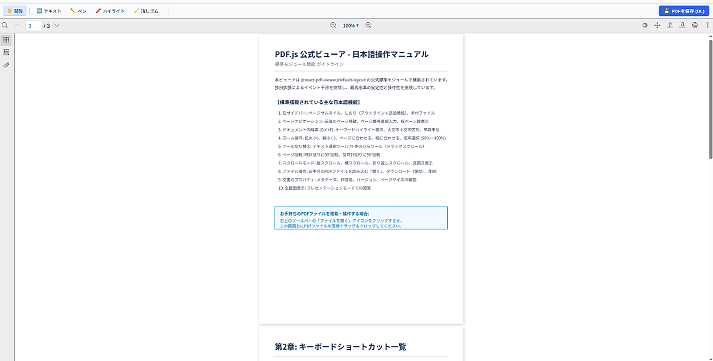

# Web PDF Editor & Viewer

ブラウザだけで安全・快適に使える、高機能な PDF 閲覧＆アノテーション編集ツールです。  
専用ソフトウェアのインストールやサーバーへのデータ送信は一切不要。お手持ちの PDF ファイルを開いて、テキストや手書きメモの書き込み、ハイライト、しおりの管理、そして編集内容をそのまま PDF として保存・印刷できます。

<p align="center">
  
</p>

---

## ✨ 3つの特徴

1. 🔒 **完全ローカル処理（100%のプライバシー保護）**  
   読み込んだ PDF や入力したデータはサーバーへ一切送信されません。すべてお使いのブラウザ内部でのみ処理されるため、機密書類や個人情報を含む文書も安全に取り扱えます。

2. ✍️ **直感的で充実した注釈（アノテーション）機能**  
   文字入力、手書きペン、蛍光ハイライト、消しゴムなど、PDF に直接書き込むためのツールが揃っています。フォントサイズや色の変更、位置のドラッグ移動も自由自在です。

3. 💾 **編集内容をそのままPDFへ埋め込み保存・印刷**  
   書き込んだテキストやメモ、しおり情報は、標準的な PDF 規格に準拠してファイル内部へ直接保存されます。Adobe Acrobat やブラウザの標準ビューアなど、他の環境で開いても同じように表示・印刷できます。

---

## 📖 このソフトでできること

### 1. PDF を開く・閲覧する
- **かんたんファイル読み込み**:
  - 画面上部の「**ファイルを開く**」ボタンをクリック
  - キーボードショートカット（`Ctrl + O` / `Cmd + O`）
  - 画面全体への**ドラッグ＆ドロップ**
- **快適なビューア機能**:
  - ページの連続スクロール、拡大・縮小（50%〜400%）、見開き表示、ページ回転
  - 左サイドバーのサムネイル一覧からのページ移動
  - PDF 内部の目次（アウトライン）表示
  - 文書内テキストの全文検索（`Ctrl + F`）

### 2. テキストを書き込む（テキストボックス機能）
- **自由な位置に配置**: ツールバーの「テキスト」ボタン、または画面上のダブルクリックで好きな場所に文字枠を追加できます。
- **直感的な操作**:
  - 配置したテキストはドラッグ＆ドロップで自由に位置調整可能
  - ダブルクリックでいつでも内容を再編集
  - フォントサイズ（12px〜40px）や文字色のリアルタイム変更
  - 日本語入力（IME）に完全対応し、Enterキーや「完了」ボタンでスムーズに確定

### 3. 手書きペン & ハイライトでメモする
- **✏️ 手書きペン**:
  - 自由な線で図やサイン、手書きメモを記入可能
  - 線の太さ（1px〜18px）とカラー（青・赤・黒・緑・橙・紫）を自由に切り替え
- **🖍️ フリーハンドハイライト**:
  - マーカーペン感覚で、大切な文章や図の上に半透明のハイライトを描画（4色対応）
- **📑 本文テキスト選択ハイライト**:
  - PDF の本文テキストをマウスでなぞって選択すると、ポップアップからワンクリックで綺麗なマーカー（黄・緑・青・桃）を付与
- **🧹 消しゴムツール**:
  - クリックまたはドラッグで、書き込んだ手書き線やテキスト注釈をかんたんに消去

### 4. しおり（ブックマーク）をつける
- **ワンクリックでしおり追加**: 読んでいるページや後で見返したいページで「現在のページをしおりに追加」を押すだけ。
- **クイックジャンプ**: サイドバーのしおり一覧をクリックすれば、目的のページへ一瞬で移動できます。
- **不要なしおりの削除**: 追加したしおりは個別に削除可能です。

### 5. 編集した PDF を保存・印刷する
- **📥 PDFを保存（ダウンロード）**:
  - 画面右上の「PDFを保存 (DL)」ボタンを押すと、すべての書き込み（テキスト、手書き線、ハイライト、しおり）が埋め込まれた新しい PDF ファイルがダウンロードされます。
- **🖨️ 注釈付き印刷**:
  - 書き込んだ内容が反映された状態で、ブラウザの標準印刷ダイアログから綺麗にプリントアウトできます（`Ctrl + P`）。

### 6. 作業中のデータを保護する
- **離脱・リロード防止**: 未保存の書き込みがある状態で誤ってブラウザをリロードしたりタブを閉じようとした場合、警告メッセージを表示して大切な作業内容を守ります。

---

## ⌨️ 便利なキーボードショートカット

| ショートカット | 機能 |
| :--- | :--- |
| `Ctrl + O` / `Cmd + O` | PDF ファイルを開く |
| `Ctrl + P` / `Cmd + P` | 印刷プレビュー（注釈反映済み） |
| `Ctrl + F` | PDF 文書内のテキスト検索 |
| `Enter` | テキストボックス入力の確定・完了 |
| `Escape` | テキストボックス編集の終了 |
| `Delete` / `Backspace` | 選択中のテキスト注釈を削除 |
| `Ctrl + スクロール` | 画面の拡大・縮小 |

---

## 🚀 使い方（クイックスタート）

### 前提環境
- **Node.js**: v18.0.0 以上
- **npm**: v9.0.0 以上

### インストールと起動

```bash
# リポジトリのクローン
git clone https://github.com/kimuchi0141/Web-pdf-editor.git
cd Web-pdf-editor

# 依存パッケージのインストール
npm install

# 開発サーバーの起動 (ブラウザで http://localhost:5173/ を開く)
npm run dev

# プロダクション用ビルド
npm run build
```

---

## 🛠️ 技術スタック

- **UI & フロントエンド**: React 18, React DOM
- **ビルドツール**: Vite 5
- **PDF 表示エンジン**: PDF.js (`pdfjs-dist`), `@react-pdf-viewer`
- **PDF 編集・生成**: `pdf-lib`

---

## 📄 ライセンス

本プロジェクトは [MIT License](LICENSE) のもとで公開されています。商用・非商用を問わずどなたでも自由にご利用いただけます。
